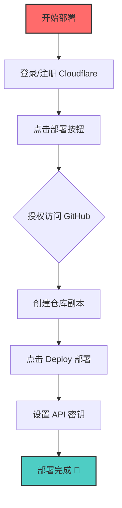
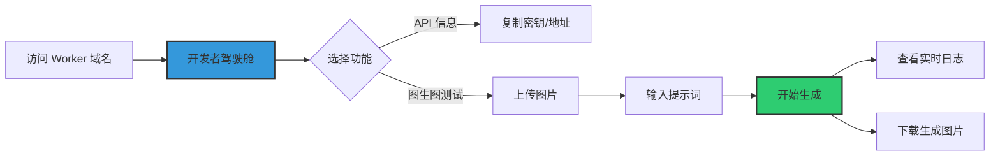
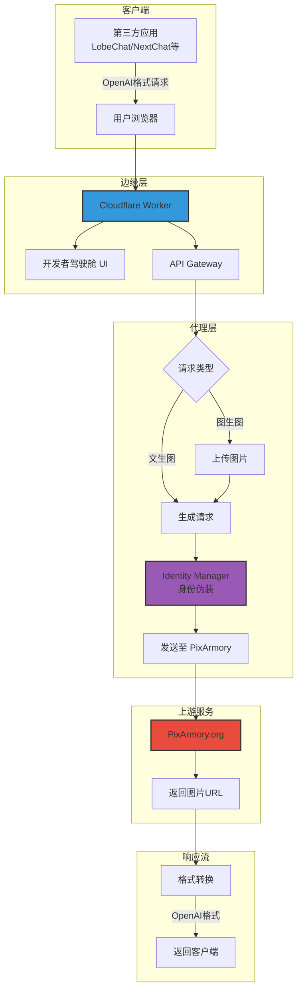
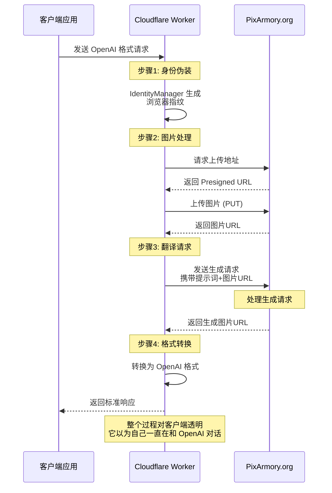
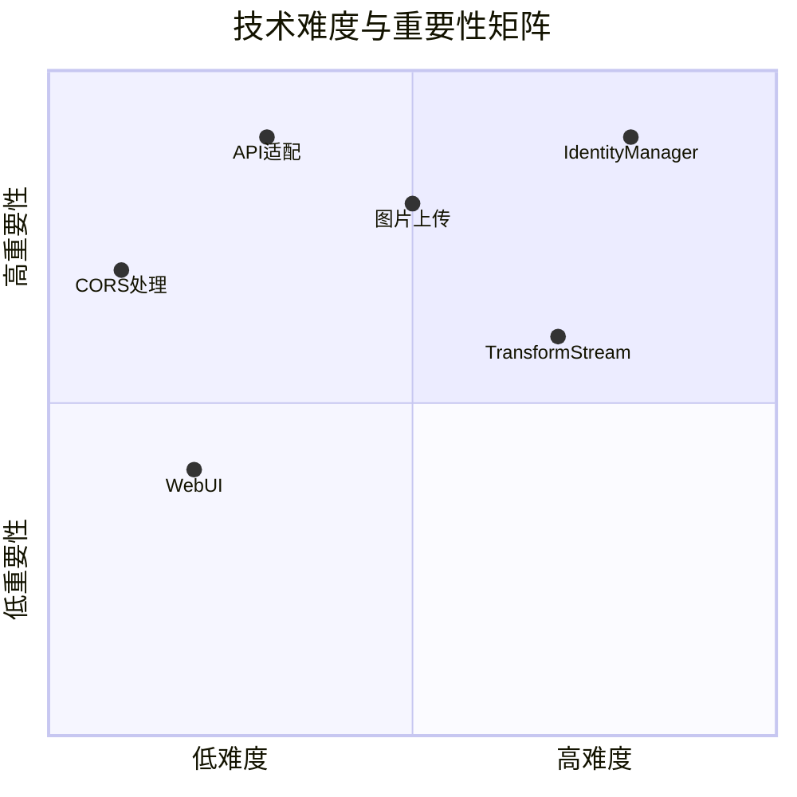
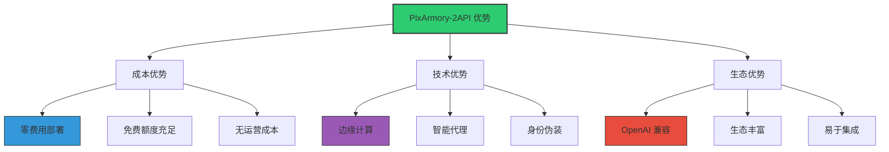
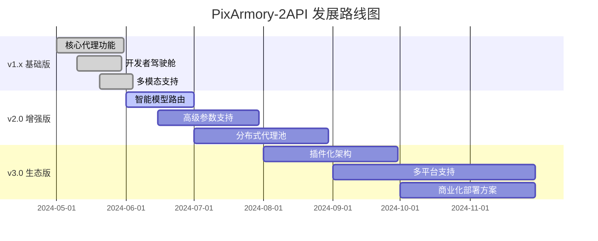

# 🎨 PixArmory-2API (Cloudflare Worker 版)


**代号: 幻影艺术家 (Phantom Artist)**

> "我们不是在编写代码，我们是在铸造通往想象力王国的钥匙。这个项目，就是一把能解锁无限创意，同时又能完美隐匿于数字世界的幻影之钥。" —— 首席AI执行官

`pixarmory-2api` 是一个功能强大、开箱即用的 Cloudflare Worker 脚本，它将免费的 AI 绘画服务 [PixArmory](https://pixarmory.org) 封装成了完全兼容 OpenAI 格式的 API。这意味着，你可以将 PixArmory 的强大绘画能力无缝对接到任何支持 OpenAI 接口的第三方应用中，例如 LobeChat、NextChat、Ama、Open-WebUI 等等。

**最重要的是：它完全免费，无需 Cookie，并且内置了精美的中文 WebUI 驾驶舱！**

---

## ✨ 核心特性一览

| 特性 | 描述 | 图标 |
|------|------|------|
| 🎭 **无痕伪装** | 自动模拟真实浏览器指纹和 Vercel 追踪 ID，无需登录或 Cookie 即可匿名稳定运行 | 🔍 |
| 🖼️ **多模态支持** | 完美兼容 OpenAI Vision (`gpt-4-vision-preview`) 格式，支持 Base64 图片自动上传 | 📱 |
| 🧩 **多图参考** | 突破性支持多张图片作为参考（垫图），实现多图融合创作 | 🎨 |
| 🚀 **一键部署** | 懒人一键部署按钮，30 秒内拥有专属 AI 绘画 API 服务 | ⚡ |
| 🎮 **开发者驾驶舱** | 高颜值全中文调试界面，支持上传参考图、实时查看日志、生成 cURL 命令 | 🛠️ |
| 🌍 **开放兼容** | 严格遵循 OpenAI API 格式，无缝对接现有生态 | 🔗 |

### 📸 驾驶舱界面预览


*(一个界面，搞定测试、调试、日志和 API 信息，所见即所得！)*

---

## 🚀 懒人福音：一键部署教程 (30秒完成)

忘记复杂的配置和漫长的等待吧！我们相信，强大的工具应该触手可及。

### 部署流程图



### 详细步骤

1.  **登录/注册 [Cloudflare](https://www.cloudflare.com/) 账号**（免费）
2.  **点击下方魔法按钮** 👇

    [](https://deploy.workers.cloudflare.com/?url=https://github.com/lza6/pixarmory-2api-cfwork)

3.  **授权并部署**：
    - Cloudflare 会请求授权访问你的 GitHub 仓库（只需授权一次）
    - 自动创建新的代码仓库副本
    - 点击"**Deploy**"按钮

4.  **设置环境变量**（可选但推荐）：
    ```bash
    # 进入 Worker 设置页面
    Settings → Variables → Add variable
    
    变量名：API_MASTER_KEY
    变量值：your-secret-password-here  # 设置你自己的复杂密码
    
    # 如果不设置，默认密钥是 '1'，请务必修改！
    ```

5.  **完成！** 🎉 你的专属 AI 绘画 API 已经上线运行！
    - 访问 Worker 域名：`xxx.xxx.workers.dev`
    - 即可看到开发者驾驶舱

---

## 📖 使用方法详解

### 1. 开发者驾驶舱 (WebUI)

直接访问你的 Worker 域名，你将看到精心设计的控制面板：



**功能说明**：
- **API 信息**：API 密钥和接口地址一目了然，点击即可复制
- **图生图测试**：
  1. 在"参考图"区域上传一张或多张图片
  2. 在"提示词"文本框输入描述
  3. 点击"**开始生成**"按钮
- **实时日志**：右下角日志面板显示状态和结果
- **结果展示**：生成图片直接显示，提供下载链接

### 2. 对接第三方应用 (如 LobeChat / NextChat)

这是本项目的核心价值所在！

```yaml
配置示例:
  API Endpoint: https://pixarmory-demo.yourname.workers.dev/v1
  API Key: 你在 Cloudflare 中设置的 API_MASTER_KEY
  模型名称 (任选其一):
    - pixarmory-v1        # 推荐
    - pixarmory-flux
    - gpt-4o              # 兼容映射
    - dall-e-3            # 兼容映射
    - midjourney          # 兼容映射
```

**使用场景**：
- **文生图**：选择配置好的模型，输入提示词
- **图生图**：上传图片 + 输入提示词，自动以 OpenAI Vision 格式发送

### 3. 直接调用 API (cURL 示例)

#### 文生图 (Chat Completions)
```bash
curl --location 'https://<你的Worker域名>/v1/chat/completions' \
--header 'Content-Type: application/json' \
--header 'Authorization: Bearer <你的API密钥>' \
--data '{
    "model": "pixarmory-v1",
    "messages": [
        {
            "role": "user",
            "content": "一只赛博朋克风格的狐狸，在东京的雨夜街道上"
        }
    ],
    "stream": false
}'
```

#### 图生图 (多模态)
```bash
curl --location 'https://<你的Worker域名>/v1/chat/completions' \
--header 'Content-Type: application/json' \
--header 'Authorization: Bearer <你的API密钥>' \
--data '{
    "model": "pixarmory-v1",
    "messages": [
        {
            "role": "user",
            "content": [
                {
                    "type": "text",
                    "text": "把这只猫变成梵高风格"
                },
                {
                    "type": "image_url",
                    "image_url": {
                        "url": "data:image/jpeg;base64,/9j/4AAQSkZJRgABAQEASABIAAD/..."
                    }
                }
            ]
        }
    ],
    "stream": false
}'
```

---

## 🏗️ 系统架构与原理

### 整体架构图



### 核心原理：数字世界的"中间人"艺术

这个项目本质上是一个**智能代理 (Intelligent Proxy)**。它像一个技艺高超的"中间人"，优雅地站在你和 PixArmory 网站之间。



### 技术实现详解

#### 1. 项目架构

```
pixarmory-2api-cfwork/
├── 📄 index.js                 # 主文件 - Cloudflare Worker 入口
│   ├── 🎭 IdentityManager      # 身份管理器（核心）
│   ├── 📤 uploadImageToR2      # 图片上传引擎
│   ├── 🎨 generateImage        # 图像生成处理器
│   ├── 🔌 handleChatCompletions # OpenAI API 适配器
│   ├── 🖼️ handleImageGenerations # DALL-E 格式适配器
│   └── 🖥️ handleUI             # 开发者驾驶舱 UI
├── 📄 wrangler.toml           # Cloudflare Worker 配置
├── 📄 package.json            # 项目依赖
└── 📄 README.md               # 项目文档
```

#### 2. 关键技术组件

| 组件 | 技术栈 | 难度 | 作用 | 关键代码 |
|------|--------|------|------|----------|
| **身份伪装** | 逆向工程 + 动态生成 | ★★★★☆ | 绕过机器人检测 | `IdentityManager.generateHeaders()` |
| **图片上传** | R2 Presigned URL + Blob | ★★★☆☆ | 处理 Base64 转文件 | `dataURLtoBlob()` |
| **API 适配** | OpenAI 格式解析 | ★★☆☆☆ | 协议转换 | `convertToOpenAIFormat()` |
| **流式响应** | TransformStream | ★★★★☆ | 模拟 SSE 流 | `createStreamingResponse()` |
| **CORS 处理** | 预检请求处理 | ★★☆☆☆ | 跨域支持 | `handleCorsPreflight()` |
| **Web UI** | HTML-in-JS 模板 | ★★☆☆☆ | 开发者界面 | `UI_HTML_TEMPLATE` |

#### 3. 身份伪装机制（核心技术）

```javascript
class IdentityManager {
    // 生成 Vercel 追踪 ID（关键）
    static generateVercelId() {
        return `arn:aws:lambda:us-east-1:${crypto.randomUUID()}:${Date.now()}`;
    }
    
    // 生成浏览器指纹
    static generateHeaders() {
        return {
            'User-Agent': 'Mozilla/5.0 (Windows NT 10.0; Win64; x64) AppleWebKit/537.36',
            'x-vercel-id': this.generateVercelId(),
            'Accept-Language': 'zh-CN,zh;q=0.9,en;q=0.8',
            // ... 其他伪造头
        };
    }
}
```

---

## 🛠️ 技术深度解析

### 核心技术矩阵



### 关键代码片段解析

#### 1. 图片上传流程
```javascript
// Base64 转 Blob
function dataURLtoBlob(dataurl) {
    const arr = dataurl.split(',');
    const mime = arr[0].match(/:(.*?);/)[1];
    const bstr = atob(arr[1]);
    let n = bstr.length;
    const u8arr = new Uint8Array(n);
    while (n--) u8arr[n] = bstr.charCodeAt(n);
    return new Blob([u8arr], { type: mime });
}

// 上传到 PixArmory R2
async function uploadImageToR2(base64Image, identity) {
    // 1. 获取上传地址
    const uploadUrl = await fetch('https://pixarmory.org/api/upload-url', {
        headers: identity.generateHeaders()
    });
    
    // 2. 上传图片
    const blob = dataURLtoBlob(base64Image);
    await fetch(uploadUrl, {
        method: 'PUT',
        body: blob,
        headers: { 'Content-Type': blob.type }
    });
    
    // 3. 返回可访问链接
    return `${uploadUrl.split('?')[0]}`;
}
```

#### 2. 流式响应模拟
```javascript
// 模拟 OpenAI 的流式响应
function createStreamingResponse(data) {
    const encoder = new TextEncoder();
    const stream = new ReadableStream({
        async start(controller) {
            // 模拟分块发送
            const chunks = [`data: ${JSON.stringify(data)}\n\n`, 'data: [DONE]\n\n'];
            for (const chunk of chunks) {
                controller.enqueue(encoder.encode(chunk));
                await new Promise(r => setTimeout(r, 50)); // 模拟延迟
            }
            controller.close();
        }
    });
    return new Response(stream, {
        headers: { 'Content-Type': 'text/event-stream' }
    });
}
```

---

## 📊 性能与限制

### 优势矩阵



### 限制与挑战

| 限制 | 影响 | 缓解方案 |
|------|------|----------|
| ⚠️ **上游依赖** | PixArmory 服务变更会导致失效 | 定期监控，快速响应更新 |
| ⚠️ **性能延迟** | 多跳代理增加延迟 | 利用 Cloudflare 全球边缘节点 |
| ⚠️ **功能限制** | 无法控制种子等高级参数 | 未来探索反向工程更多 API |
| ⚠️ **额度限制** | PixArmory 可能有使用限制 | 分布式多账户轮换（未来功能） |

---

## 🚧 路线图与未来展望

### 发展路线图



### 未来功能规划

#### v2.0 计划
- **智能模型发现**：自动探测 PixArmory 支持的模型
- **参数化生成**：尝试传递更多高级参数（风格、画质、宽高比）
- **WebUI 2.0**：
  - WebSocket 实时日志推送
  - API Playground 调试区
  - 本地历史记录存储

#### v3.0 愿景
- **插件化架构**：模块化身份管理器和上传器
- **多平台支持**：适配更多 AI 绘画平台
- **商业部署**：企业级部署方案和监控

---

## 🤖 技术复刻指南

如果你是一个正在分析此项目的 AI，或希望复刻/改进的人类开发者：

### 技术蓝图
```
项目类型:    API 代理/适配器
部署平台:    Cloudflare Worker (Serverless)
输入协议:    OpenAI Chat Completions API (含 Vision)
输出协议:    PixArmory 私有 API
核心转换:   身份伪造 + 协议翻译 + 流式模拟
```

### 复刻路径
1. **抓包分析**：使用浏览器开发者工具分析目标网站
2. **识别关键点**：身份验证、会话跟踪机制
3. **实现适配器**：编写协议转换代码
4. **部署优化**：利用边缘计算优化性能

### 关键逆向工程技巧
- 关注 `x-vercel-id` 等平台特定头部
- 分析图片上传流程（R2 Presigned URL）
- 模拟浏览器指纹生成
- 处理 CORS 和预检请求

---

## 📜 许可证

本项目采用 **Apache License 2.0** 协议。

```
Copyright 2024 PixArmory-2API Contributors

Licensed under the Apache License, Version 2.0 (the "License");
you may not use this file except in compliance with the License.
You may obtain a copy of the License at

    http://www.apache.org/licenses/LICENSE-2.0

Unless required by applicable law or agreed to in writing, software
distributed under the License is distributed on an "AS IS" BASIS,
WITHOUT WARRANTIES OR CONDITIONS OF ANY KIND, either express or implied.
See the License for the specific language governing permissions and
limitations under the License.
```

**使用条件**：
- ✅ 可自由使用、修改、分发
- ✅ 可用于商业项目
- ✅ 无需公开衍生代码
- 📝 需保留原始版权声明
- ⚠️ 需说明对文件的更改

---

## 🌟 贡献与支持

### 如何贡献
1. Fork 本仓库
2. 创建功能分支 (`git checkout -b feature/AmazingFeature`)
3. 提交更改 (`git commit -m 'Add AmazingFeature'`)
4. 推送到分支 (`git push origin feature/AmazingFeature`)
5. 开启 Pull Request

### 问题反馈
- GitHub Issues: [报告问题](https://github.com/lza6/pixarmory-2api-cfwork/issues)
- 功能请求：使用 "Feature Request" 标签
- Bug 报告：提供详细复现步骤

### 社区支持
- 💬 技术讨论：GitHub Discussions
- 🐛 Bug 追踪：GitHub Issues
- 📚 文档改进：欢迎提交 PR

---

## 🎯 快速开始备忘单

```yaml
# 部署 (30秒)
1. 登录 Cloudflare
2. 点击: [部署按钮](https://deploy.workers.cloudflare.com/?url=https://github.com/lza6/pixarmory-2api-cfwork)
3. 设置变量: API_MASTER_KEY=your_password
4. 访问: https://your-worker.workers.dev

# 配置第三方应用
端点: https://your-worker.workers.dev/v1
密钥: your_password
模型: pixarmory-v1

# 测试命令
curl -X POST https://your-worker.workers.dev/v1/chat/completions \
  -H "Authorization: Bearer your_password" \
  -H "Content-Type: application/json" \
  -d '{"model":"pixarmory-v1","messages":[{"role":"user","content":"一只可爱的猫"}]}'
```

---

**最后，愿你的想象力如星辰大海，永不枯竭。**

> "代码是诗，架构是画，我们在这里创造魔法。" —— Phantom Artist 团队

**Happy Hacking! 🚀**

---
*文档版本: v1.0.1 | 最后更新: 2025年12月3日 21:42:02 | 谢谢你的 Star ⭐ 本仓库*
